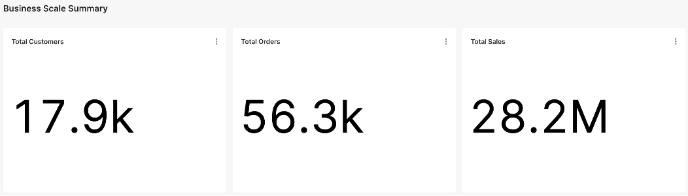
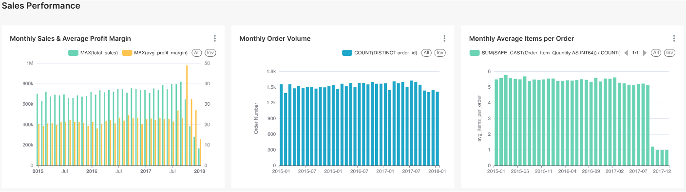
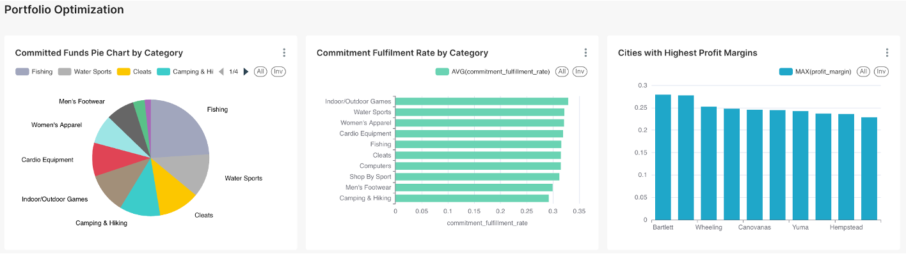

# MercaForesight

*Be patient.*

MercaForesight is an intelligent analytics platform designed for e-commerce platforms and operations teams, aiming to optimize business decisions through data-driven insights.

## Contact

| Name          | Email                |
| ------------- | -------------------- |
| Pang Yuntian | e1348859@u.nus.edu   |
| Li Zehan     | e1391133@u.nus.edu   |
| Zhang Shize  | e1351522@u.nus.edu   |
| Chen Bingxu  | chenbingxu@u.nus.edu |
| Wen Mingyuan | e1352990@u.nus.edu   |
| Zhang Yiheng | e1349382@u.nus.edu   |

## Project Overview
The project focuses on:
- SKU performance analysis and optimization.
- Dynamic inventory management.
- Real-time financial and order insights.

## Project Structure

| Path                       | Description                                      |
|----------------------------|--------------------------------------------------|
| `.github/workflows/`       | CI/CD configuration files                        |
| `assets/`                  | Static files and miscellaneous project assets    |
| `data/`                    | Data storage directory                           |
| `data/raw/`                | Raw, unprocessed data files                      |
| `data/processed/`          | Processed, cleaned, and aggregated data files    |
| `dbt/`                     | Files related to the DBT data modeling tool      |
| `dbt/models/`              | DBT models for data transformation               |
| `dbt/macros/`              | Reusable SQL macros for transformations          |
| `docs/`                    | Project documentation                            |
| `infra/`                   | Infrastructure configuration files               |
| `infra/docker/`            | Docker configuration files                       |
| `infra/terraform/`         | Terraform files for managing cloud resources     |
| `scripts/`                 | Automation scripts                               |
| `src/`                     | Source code                                      |
| `src/utils/`               | Utility functions and common modules             |
| `src/streaming/`           | Streaming data processing tasks                  |
| `src/batch/`               | Batch processing tasks                           |
| `tests/`                   | Test code                                        |

For more details, refer to the `README` files in each subdirectory.

## Data Sources

The system integrates with three types of data sources:

1. **CSV Files**: Raw data files containing historical business data.
2. **Real-time Stream API**: Simulated real-time data streams for continuous data flow.
3. **MySQL Database**: Operational database with change data capture enabled.

## Data Ingestion

Data is ingested into the system through:

1. **Spark**: Used for loading and ingesting CSV files into the data lake.
2. **Kafka**: Handles real-time data ingestion from streaming sources.
3. **Debezium**: Captures and ingests database changes from MySQL.

### Build & Run Commands

#### 1. Start Infrastructure Services
```bash
# Start Kafka and Zookeeper
docker-compose -f infra/docker/kafka/docker-compose.yml up -d

# Start MySQL with CDC enabled
docker-compose -f infra/docker/mysql/docker-compose.yml up -d

# Start Debezium
docker-compose -f infra/docker/debezium/docker-compose.yml up -d
```

#### 2. Run Data Ingestion
```bash
# Run csv ingestion (CSV files)
python src/batch/gcs_export_pipeline/pipeline.py

# Run streaming ingestion (Kafka)
python src/streaming/kafka_to_gcs_streaming/streaming_pipeline.py

# Start CDC ingestion
python src/ingestion/cdc_manager.py
```

#### 3. Monitor Ingestion
```bash
# Check Kafka topics
docker exec -it kafka kafka-topics.sh --list --bootstrap-server localhost:9092

# Monitor Debezium connectors
curl -X GET http://localhost:8083/connectors

# View ingestion logs
docker-compose -f infra/docker/logs/docker-compose.yml up -d
```

## Visualization

Run superset

```bash
git clone https://github.com/apache/superset
cd superset
git checkout tags/4.1.2
docker compose -f docker-compose-image-tag.yml up
```

Login

```
username: admin
password: admin
```

Result





