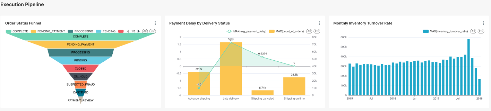

# MercaForesight

MercaForesight is an intelligent analytics platform designed for e-commerce platforms and operations teams, aiming to optimize business decisions through data-driven insights.

## Contact

| Name          | Email                |
| ------------- | -------------------- |
| Pang Yuntian | e1348859@u.nus.edu   |
| Li Zehan     | e1391133@u.nus.edu   |
| Zhang Shize  | e1351522@u.nus.edu   |
| Chen Bingxu  | chenbingxu@u.nus.edu |
| Wen Mingyuan | e1352990@u.nus.edu   |
| Zhang Yiheng | e1349382@u.nus.edu   |

## Prerequisites

### Cloud Resources
1. **Google Cloud Storage (GCS)**
   - Create a GCS bucket for data storage
   - Configure bucket permissions and lifecycle policies
   - Service account with Storage Admin role
   - Download service account key and save as `gcs-credentials.json`

2. **BigQuery**
   - Create a BigQuery project and dataset
   - Configure dataset permissions
   - Service account with BigQuery Admin role
   - Ensure the same service account key has BigQuery access

3. **Mage**
   - Set up Mage cloud instance
   - Configure project settings and environment variables
   - Set up data pipeline connections
   - Configure monitoring and alerting
   - Access UI at http://localhost:6789 (local development)
   - Configure environment variables in `.env` file

### Local Development Environment
1. **Docker & Docker Compose**
   - Docker Engine 20.10.0+
   - Docker Compose 2.0.0+

2. **Python Environment**
   - Python 3.8+

3. **Database**
   - PostgreSQL 14.0+
   - MySQL 8.0+

4. **Message Queue**
   - Apache Kafka 7.3.0+
   - Zookeeper 7.3.0+

5. **Data Processing**
   - Apache Spark 3.3.1+
   - DBT Core 1.0.0+
   - Debezium 2.0+

### Infrastructure Services
The following services will be automatically set up using Docker Compose:
- Kafka & Zookeeper
- PostgreSQL
- Debezium
- Spark (Master & Worker)

## Project Structure

| Path                       | Description                                      |
|----------------------------|--------------------------------------------------|
| `.github/workflows/`       | CI/CD configuration files                        |
| `assets/`                  | Static files and miscellaneous project assets    |
| `data/`                    | Data storage directory                           |
| `data/raw/`                | Raw, unprocessed data files                      |
| `data/processed/`          | Processed, cleaned, and aggregated data files    |
| `dbt/`                     | Files related to the DBT data modeling tool      |
| `dbt/models/`              | DBT models for data transformation               |
| `dbt/macros/`              | Reusable SQL macros for transformations          |
| `docs/`                    | Project documentation                            |
| `infra/`                   | Infrastructure configuration files               |
| `infra/docker/`            | Docker configuration files                       |
| `infra/terraform/`         | Terraform files for managing cloud resources     |
| `scripts/`                 | Automation scripts                               |
| `src/`                     | Source code                                      |
| `src/utils/`               | Utility functions and common modules             |
| `src/streaming/`           | Streaming data processing tasks                  |
| `src/batch/`               | Batch processing tasks                           |
| `tests/`                   | Test code                                        |

For more details, refer to the `README` files in each subdirectory.

## Data Sources

The system integrates with three types of data sources:

1. **CSV Files**: Raw data files containing historical business data.
2. **Real-time Stream API**: Simulated real-time data streams for continuous data flow.
3. **MySQL Database**: Operational database with change data capture enabled.

## Data Ingestion

Data is ingested into the system through:

1. **Spark**: Used for loading and ingesting CSV files into the data lake.
2. **Kafka**: Handles real-time data ingestion from streaming sources.
3. **Debezium**: Captures and ingests database changes from MySQL.

### Build & Run Commands

#### 1. Start Infrastructure Services
```bash
# Start Kafka and Zookeeper
docker-compose -f infra/docker/kafka/docker-compose.yml up -d

# Start MySQL with CDC enabled
docker-compose -f infra/docker/mysql/docker-compose.yml up -d

# Start Debezium
docker-compose -f infra/docker/debezium/docker-compose.yml up -d
```

#### 2. Run Data Ingestion
```bash
# Run csv ingestion (CSV files)
python src/batch/gcs_export_pipeline/pipeline.py

# Run streaming ingestion (Kafka)
python src/streaming/kafka_to_gcs_streaming/streaming_pipeline.py

# Start CDC ingestion
python src/ingestion/cdc_manager.py
```

#### 3. Monitor Ingestion
```bash
# Check Kafka topics
docker exec -it kafka kafka-topics.sh --list --bootstrap-server localhost:9092

# Monitor Debezium connectors
curl -X GET http://localhost:8083/connectors

# View ingestion logs
docker-compose -f infra/docker/logs/docker-compose.yml up -d
```

#### 4. Run DBT Commands
```bash
# Install DBT
pip install dbt-core dbt-bigquery

# Configure profiles.yml to connect to your database

# Run all models
dbt run

# Generate documentation
dbt docs generate

# Serve documentation locally
dbt docs serve
```

Note: Make sure to configure your `profiles.yml` file with the correct database connection settings before running DBT commands.

## Visualization

Run superset

```bash
git clone https://github.com/apache/superset
cd superset
git checkout tags/4.1.2
docker compose -f docker-compose-image-tag.yml up
```

Login

```
username: admin
password: admin
```

Result




